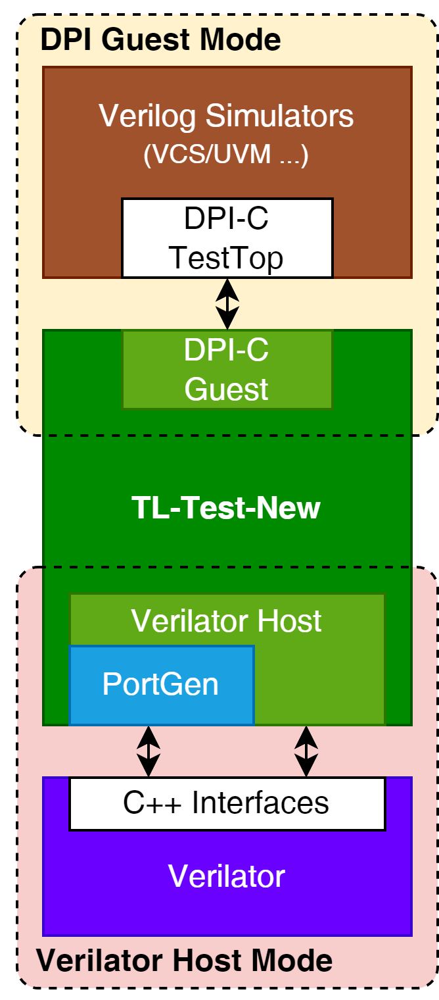
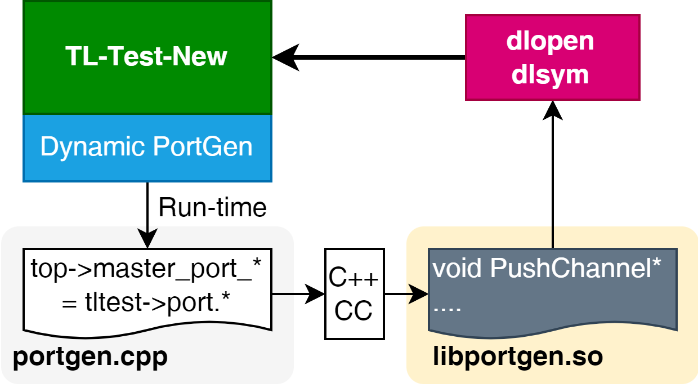
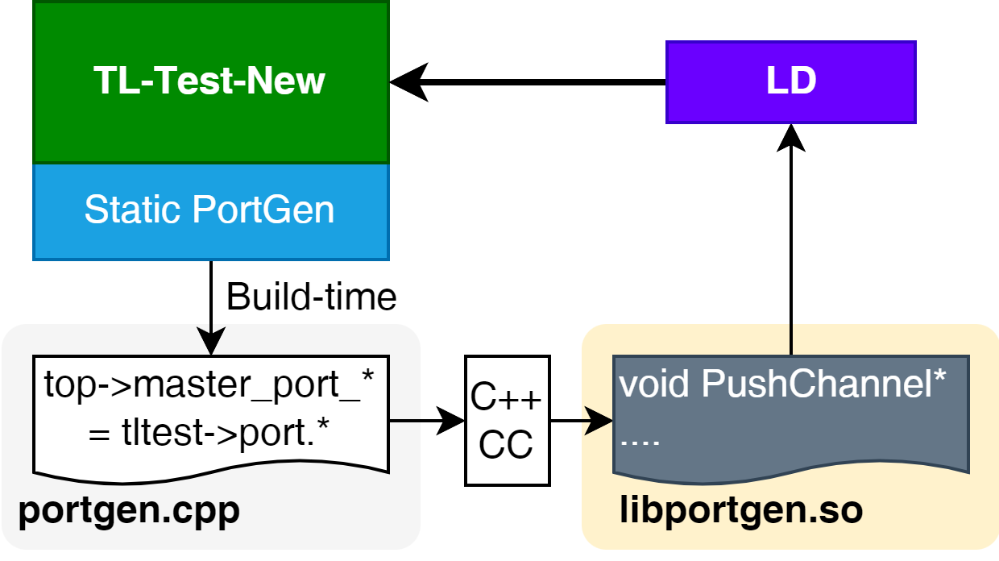

# TL-Test-New

> TL-Test-New  
> The **Unified TileLink Memory Subsystem Tester for XiangShan**
> 

>   
> **"WELCOME TO THE NEW WORLD !"**  
> The Next Generation TL-Test
> ```
> ████████╗██╗           ████████╗███████╗███████╗████████╗      ███╗   ██╗███████╗██╗    ██╗ 
> ╚══██╔══╝██║           ╚══██╔══╝██╔════╝██╔════╝╚══██╔══╝      ████╗  ██║██╔════╝██║    ██║ 
>    ██║   ██║     █████╗   ██║   █████╗  ███████╗   ██║   █████╗██╔██╗ ██║█████╗  ██║ █╗ ██║ 
>    ██║   ██║     ╚════╝   ██║   ██╔══╝  ╚════██║   ██║   ╚════╝██║╚██╗██║██╔══╝  ██║███╗██║ 
>    ██║   ███████╗         ██║   ███████╗███████║   ██║         ██║ ╚████║███████╗╚███╔███╔╝ 
>    ╚═╝   ╚══════╝         ╚═╝   ╚══════╝╚══════╝   ╚═╝         ╚═╝  ╚═══╝╚══════╝ ╚══╝╚══╝    
> ```  
> &emsp;


## Features


### 1. Simulator compatibility
* Full simulation compatiblity support for both **Verilator Host Mode** and **DPI Guest Mode**  
    * **Verilator Host Mode**: Run under **verilator** simulator as test host
    * **DPI Guest Mode**: Run under **ALL** verilog simulator as test guest (tested on **VCS & Verdi**)  

### 2. Memory sub-system testing for XiangShan  
* Accurate **memory consistency check** using scoreboard  
* Specially constrained TileLink transaction sequence for L2 (**CoupledL2** for now) private design  
* Cache line alias control for L2 (**CoupledL2** for now) private design  
* Easy post-compile TileLink agent and port configuration (for core count, TL-C port count for L1D, TL-UL port count for L1I & PTW ...)   

### 3. Extensibility and legacy debugging support 
* [BullsEye Gravity](https://github.com/arch-simulator-sig/BullsEye/tree/master) **EventBus utility** for event-driven extensive controls  
* Full support for **ChiselDB** through plug-in  
* Detailed and fine-grained controllable verbose information    
* Now **zero memory leakage** in TileLink testing sub-system  
* Almost zero change required for current L1, L2 RTL design   
* **TODO:** TileLink Protocol Analyzer (TLPA - TLEye) through ChiselDB  
* **TODO:** XiangShan L1 Trace support  
* **TODO:** Fuzzing Trace for case reproduciblity  
* **TODO:** CHILog integration for CoupledL2-CHI  

### 4. Automated Range Iteration (ARI) fuzz testing  
* Multiple fuzzing constraints (targeting at different fuzz testing cases) could be specified on compile-time for every single run  
* Automated iteration of fuzzing constraints on runtime  
* Advanced control of TileLink transaction sequencing  

### 5. Automated Port Connection (PortGen) for verilator host
* No more manual wiring on TileLink ports
* Both pre-compile (**static mode**) and post-compile (**dynamic mode**) port connection support with dynamic library


## Project tree
```
.
├── README.md
└── main            <- TL-Test-New main project root
    ├── Base                <- Basic components
    ├── CMakeLists.txt      <- CMake makefile
    ├── DPI                 <- DPI support components (DPI headers, DPI targeted configs ...)
    ├── Events              <- Testing system event components
    ├── Fuzzer              <- Fuzzer & ARI implementations
    ├── Plugins             <- Embedded plugins
    ├── PortGen             <- PortGen components
    ├── Sequencer           <- TL-Test-New testing system object
    ├── System              <- TL-Test-New testing system procedures
    ├── TLAgent             <- TileLink C & UL agents
    ├── Utils               <- Utilities
    └── V3                  <- Verilator host main
```

## Build
### 1. Build
#### 1.1 Before you build
&emsp;&emsp;Make sure that you are currently under the **main folder** of TL-Test-New ```cd main```.  
&emsp;&emsp;For first time build:
```bash 
mkdir build && cd build
cmake ..
```
> **NOTICE**: Building under other directories is also allowed, then change the cmake command on your demand
>

#### 1.2 Verilating
> This step could be **skipped** if you chose **NOT TO BUILD Verilator Host Mode** components by: 
> ```bash
> cmake .. -DBUILD_V3=0
> ```   
> For more information, see chatper [**Build Configuration**](#build-configuration).
> 
&emsp;&emsp;Then you need to generate cpp files and library files using verilator.  
&emsp;&emsp;Requirements of verilating:
*  Use ```--cc``` parameter to generate C++ files  
*  Use ```--lib-create vltdut``` parameter to specify the output library to **```libvltdut.a```**   

&emsp;&emsp;Verilator build script for reference:  
```bash
verilator --trace --cc --build --lib-create vltdut --Mdir ./verilated ./coupledL2/build/*.v -Wno-fatal --top TestTop
```
> **INFO:**  
> For this error emitting on verilating CoupledL2: 
> ```log
> %Error: coupledL2/build/LogPerfHelper.v:14:24: Can't find definition of scope/variable: 'SimTop'
>  14 | assign timer         = SimTop.timer;
>     |                        ^~~~~~
> ```  
> In file **```LogPerfHelper.v```**: 
> ```verilog
> `ifndef SIM_TOP_MODULE_NAME
>     `define SIM_TOP_MODULE_NAME SimTop
> `endif
> ```
> Modify the default ```SIM_TOP_MODULE_NAME``` macro definition from ```SimTop``` to ```TestTop```. 
> 

#### 1.3 Building
```bash
make -j `nproc`
```  
> **NOTICE:** 
> Before you **make**:  
> * You need to set-up related project path and environment variables correctly, see chapter [**Build Configuration**](#build-configuration)  
> * You need to set-up verilator include path correctly for **Verilator Host Mode**, see chapter [**Build Configuration**](#build-configuration)  
> * You need to **set-up PortGen** correctly for **Verilator Host Mode**, see chapter [**Build Configuration**](#build-configuration)  
> 
&emsp;&emsp;The default working tree without user configuration is:  
```
.
├── README.md               
├── main            <- TL-Test-New main project root
└── verilated       <- Verilator output directory of DUT
    ├── VTestTop.h          <- The verilator generated cpp top header of DUT
    ├── libvltdut.a         <- The verilator generated static library of DUT
    └── ...
```  
&emsp;&emsp;After build, these main files would be emitted on full build:  
```
.
├── README.md
└── main
    ├── ...
    └── build
        ├── ...
        ├── libtltest_dpi.so        <- Shared library for DPI Guest Mode
        ├── portgen                 <- Static PortGen application
        ├── portgen.cpp             <- Static PortGen generated cpp source
        ├── tltest.ini              <- User configuration file for PortGen
        ├── tltest_portgen.so       <- Static PortGen runtime shared library
        └── tltest_v3lt             <- Verilator Host Mode executable
```

### 2. Clean
```bash
make clean
```

## Build Configuration
### 1. Paths and executables  
#### 1.1 ```CMAKE_CXX_COMPILER```  
&emsp;&emsp;Specify the **user-defined C++ compiler** for build-time and run-time procedures on demand.  
* Configuring: 
    * ```cmake .. -DCMAKE_CXX_COMPILER=<compiler>```   
* Passing to compiler:
    * ```-DCXX_COMPILER="${CMAKE_CXX_COMPILER}"``` as global macro ```CXX_COMPILER```

#### 1.2 ```CMAKE_CURRENT_SOURCE_DIR```  
&emsp;&emsp;Specify the **user-defined current source directory** on demand.  
* Configuring:
    * ```cmake .. -DCMAKE_CURRENT_SOURCE_DIR=<dir>```  
* Passing to compiler:  
    * ```-DCURRENT_PATH="${CMAKE_CURRENT_SOURCE_DIR}"``` as global macro ```CURRENT_PATH```  

#### 1.3 ```VERILATED_PATH```  
&emsp;&emsp;Specify the **verilator output path** of DUT.  
* Configuring:  
    * ```cmake .. -DVERILATED_PATH=<dir>```  
* Passing to compiler:  
    * ```-DVERILATED_PATH="${VERILATED_PATH}"``` as global macro ```VERILATED_PATH```  
    * ```-DVERILATED_PATH_TOKEN=${VERILATED_PATH}``` as global macro ```VERILATED_PATH_TOKEN```  

#### 1.4 ```VERILATOR_INCLUDE```  
&emsp;&emsp;Specify the **verilator include path**.
* Configuring:  
    * ```cmake .. -DVERILATOR_INCLUDE=<dir>```  
* Passing to compiler:  
    * ```-DVERILATOR_INCLUDE="${VERILATOR_INCLUDE}"``` as global macro ```VERILATOR_INCLUDE```  

### 2. PortGen  

#### 2.1 Dynamic PortGen (Experimental)


&emsp;&emsp;Choose to generate PortGen connection library on run-time (experimental function).  
* Configuring:
    * ```cmake .. -DTLTEST_PORTGEN_DYNAMIC=1```  

&emsp;&emsp;Dynamic PortGen mode is available only when the TL-Test Subsystem is delivered with all source code (including the verilator output of DUT), and is **disabled by default**.    
&emsp;&emsp;Dynamic PortGen enables you to change the TileLink port configuration at run-time through ```tltest.ini``` for **Verilator Host Mode**, without any extra coding.  
&emsp;&emsp;Dynamic PortGen requires accessible ```/tmp``` directory and working C++ compilers (support at least C++17) on verilator running environment.  
&emsp;  
&emsp;&emsp;***NOTICE**: When using Dynamic PortGen, the source code directory and verilator output directory on build must not be moved or removed.   

#### 2.2 Static PortGen


&emsp;&emsp;Choose to generate PortGen connection library on build-time.
* Configuring:
    * ```cmake .. [-DTLTEST_PORTGEN_DYNAMIC=0]```  

&emsp;&emsp;Static PortGen enables you to change the TileLink port configuration at build-time through ```tltest.ini``` or ```portgen``` executable with parameters for **Verilator Host Mode**, without any extra coding.    
&emsp;&emsp;```VERILATED_PATH``` and ```VERILATOR_INCLUDE``` parameters above are required to be configured correctly.   

&emsp;&emsp;**By default**, the PortGen is under **static mode** as ```TLTEST_PORTGEN_DYNAMIC=0``` without specifying the parameter.

### 3. Build selection 
#### 3.1 ```BUILD_DPI```
&emsp;&emsp;Build components of **DPI Guest Mode** or not.  
* Configuring: 
    * ```cmake .. -DBUILD_DPI=<ON/OFF>```   

&emsp;&emsp;By default, ```BUILD_DPI=ON```.  
&emsp;&emsp;When this was turned off, components and outputs of **DPI Guest Mode** would not be built.

#### 3.2 ```BUILD_V3```
&emsp;&emsp;Build components for **Verilator Host Mode** or not.  
* Configuring: 
    * ```cmake .. -DBUILD_V3=<ON/OFF>```  

&emsp;&emsp;By default, ```BUILD_V3=ON```.  
&emsp;&emsp;When this was turned off, components and outputs of **Verilator Host Mode** would not be built.  

## Run as **Verilator Host**
&emsp;&emsp;Run executable **```tltest_v3lt```** to start the verilator test.   
&emsp;&emsp;In build directory: 
```bash
./tltest_v3lt
```  
&emsp;&emsp;You could copy the binary **```tltest_v3lt```** with **```tltest_portgen.so```** (when compiled with **Static PortGen**) together to other directories or delivery to execute on demand.  
&emsp;&emsp;When compiled with **Dynamic PortGen**, the binaries must be delivered with source code of TL-Test-New and verilator output.  

## Load as **DPI Guest**
&emsp;&emsp;Load DPI-C library **```libtltest_dpi.so```** on simulation run.  
> **EXAMPLE** (on VCS):  
> * Add parameter ```-sv_liblist bootstrap_lib_files``` on VCS run.  
> * Create a file naming **```bootstrap_lib_files```**, and edit it with the following contents:  
> ```
> #!SV_LIBRARIES
> tl-test/main/build/libtltest_dpi
> ```  
>

## Post-build Configuration
&emsp;&emsp;On the start-up procedure of TL-Test-New, the file **```tltest.ini```** in the working directory would be read if exists to override the pre-build defined configurations.  
&emsp;&emsp;The example and template of **```tltest.ini```** is as follwing:  
```ini
[tltest.config]
core                        = 4
core.tl_c                   = 1
core.tl_ul                  = 2

[tltest.fuzzer]
seed                        = 1001
ari.interval                = 1000000
ari.target                  = 1

[tltest.logger]
verbose                     = 1
verbose.xact_fired          = 1
verbose.xact_sequenced      = 0
verbose.xact_data_complete  = 1
verbose.data_full           = 0
verbose.agent_debug         = 0
```  
&emsp;&emsp;***NOTICE**: Not all key-values above were required to be present, and the absent configuration key-values would be set as it was on build.  

### 1. Essential configurations (```tltest.config```)  
#### 1.1 ```core```  
&emsp;&emsp;Specify the **core count** of DUT.  

#### 1.2 ```core.tl_c```
&emsp;&emsp;Specify the **TileLink-C port count per core** of DUT.  
&emsp;&emsp;The acceptable value is ``1``.  

#### 1.3 ```core.tl_ul```  
&emsp;&emsp;Specify the **TileLink-UL port count per core** of DUT.  
&emsp;&emsp;The acceptable values are ``0`` and ``2``.  

### 2. Fuzzer & ARI configurations (```tltest.fuzzer```)  
#### 2.1 ```seed```  
&emsp;&emsp;Specify the **randomization seed** of this run.  

#### 2.2 ```ari.interval```  
&emsp;&emsp;Specify the **simulation time of each iteration element of ARI** of this run.

#### 2.3 ```ari.target```  
&emsp;&emsp;Specify the **total count of iteration cycle of ARI** of this run.  
&emsp;&emsp;The total simulation time to finish is calculated by: ```total_time = ARI::element_count * ari.interval * ari.target```.  
&emsp;&emsp;***NOTICE:** The ```ARI::element_count``` is specified on build currently.  

### 3. Verbose logging configurations (```tltest.logger```)  
#### 3.1 ```verbose```  
&emsp;&emsp;Specify the enablement of **verbose information mode**.  

#### 3.2 ```verbose.xact_fired```  
&emsp;&emsp;Specify the enablement of verbose information on every message fired.  

#### 3.3 ```verbose.xact_sequenced```  
&emsp;&emsp;Specify the enablement of verbose information on every message sequenced by the sequencer and the fuzzer.  

#### 3.4 ```verbose.xact_data_complete```  
&emsp;&emsp;Specify the enablement of verbose information on every transaction carrying data is completed (useful for multi-beat data transactions).  

#### 3.5 ```verbose.data_full```  
&emsp;&emsp;Specify the enablement of verbose information of full data bytes on every transaction carrying data.  
&emsp;&emsp;Recommended to disable by default for a normally relatively more readable log.  

#### 3.6 ```verbose.agent_debug```  
&emsp;&emsp;Specify the enablement of verbose information of agent debug.  
&emsp;&emsp;Recommended to disable by default, mostly used for TileLink Agent tweaking.     


## Applications
&emsp;&emsp;Nothing here for now. 
